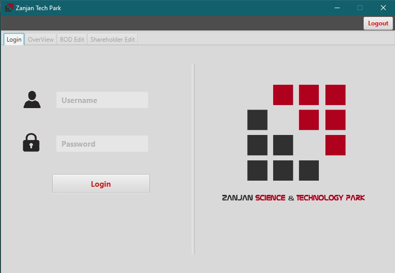
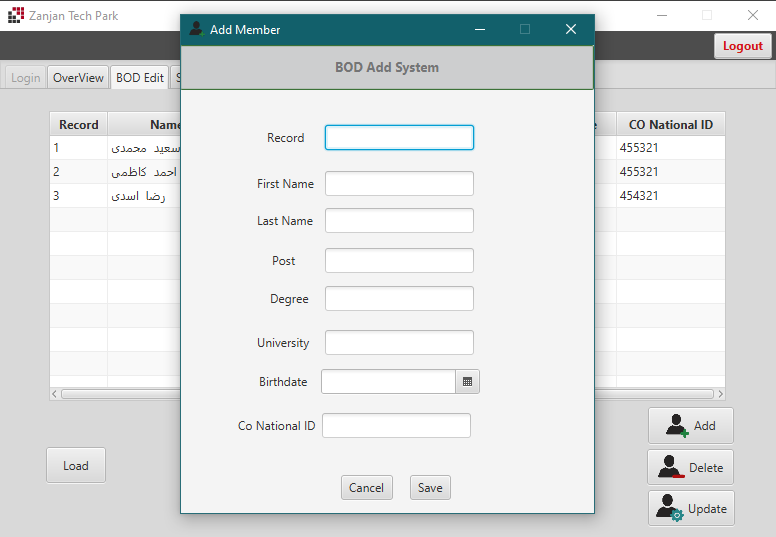

## CRUD Application
  
This project is developed for crud purposes in Database course. it uses direct sql commands to connect and manipulate `postgresql` and use `java` as programing language and `javaFX` as graphical user interface library 
The application scenario is about a tech park that registers companies which have interests in joining the park. 
### Use Cases:
- add & delete a company with initial data
- add & delete board of directors related to the company
- add & delete stackholders related to the company
- update and edit the data
- getting a list of companies and thier members

